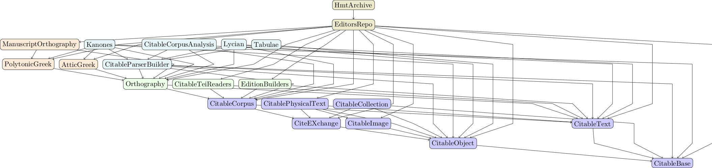

# `cite-write`

A hands-on introduction to working with the CITE architecture in Julia.

## Narrative introduction

- introductory text with embedded code examples: TBA

## Documentation

- the [`CitableBase` module](https://cite-architecture.github.io/CitableBase.jl/stable/)
- the [`CitableText` module](https://cite-architecture.github.io/CitableText.jl/stable/)
- the [`CitableCorpus` module](https://cite-architecture.github.io/CitableCorpus.jl/stable/)
- the [`Orthography` module](https://hcmid.github.io/Orthography.jl/stable/)
- the [`CitableParserBuilder` module](https://neelsmith.github.io/CitableParserBuilder.jl/stable/)
- the [`CitableCorpusAnalysis` module](https://github.com/neelsmith/CitableCorpusAnalysis.jl)

## Some Pluto notebooks

- using the `CitableText` module to work with [CTS URNs](./cts-urns.html)
- using the `CitableCorpus` module: citable text passages, documents and corpora
- using the `Orthography` module to work with explicitly defined [orthographic systems](./ortho.html)
- using the `CitableParserBuilder` module: abstractions for analyzing citable texts
- using the `CitableCorpusAnalysis` module: analyzing and profiling text corpora

